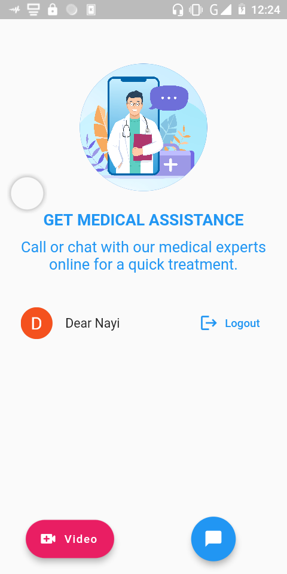

# VidCure

A video conference and patient-doctor chat app developed with Flutter, Agora SDK and FirebaseFirestore.

## Running the app

To run the app, first of all you'll need Flutter v2.2.1+ and Android Studio 4.0+.

 - Clone this repo:
    ``git clone https://github.com/nayi10/vidcure.git``

 - Navigate into the folder:
    ``cd vidcure``

 - Get packages by running:
    ``flutter pub get``

 - Connect your device, run the app and enjoy!!

A few resources to get you started if this is your first encounter with Flutter:

- [Lab: Write your first Flutter app](https://flutter.dev/docs/get-started/codelab)
- [Cookbook: Useful Flutter samples](https://flutter.dev/docs/cookbook)

For help getting started with Flutter, view the
[online documentation](https://flutter.dev/docs), which offers tutorials,
samples, guidance on mobile development, and a full API reference.
